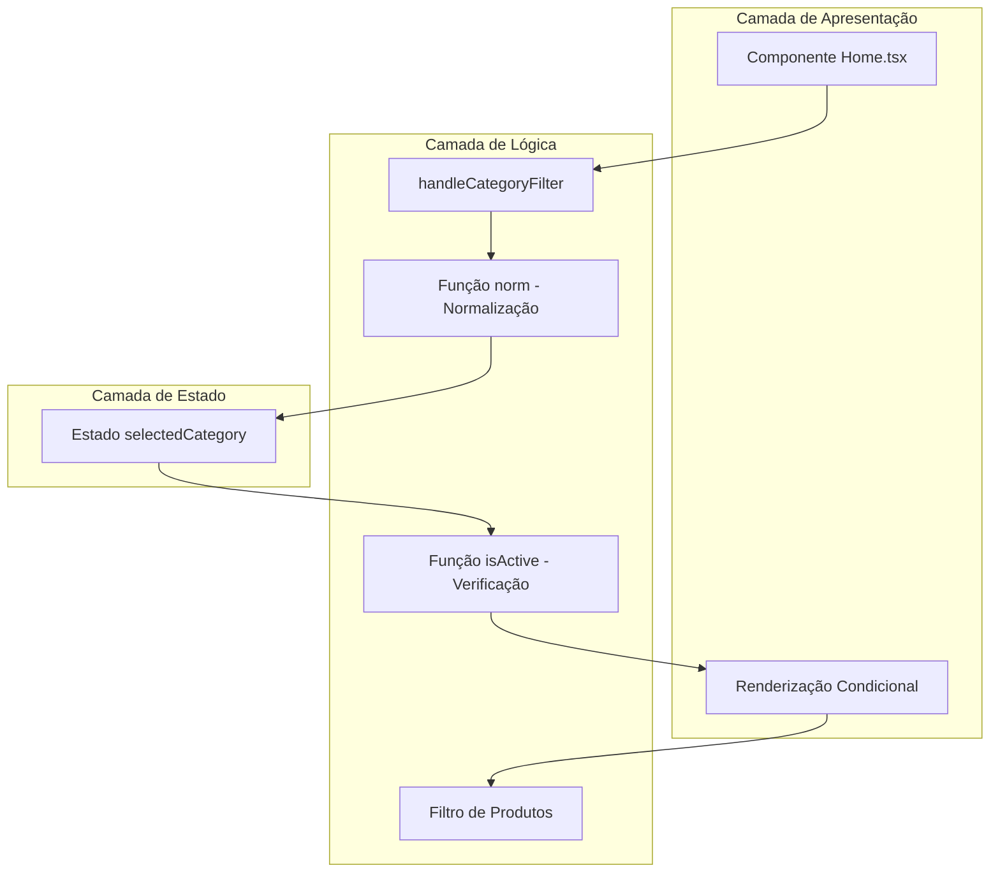
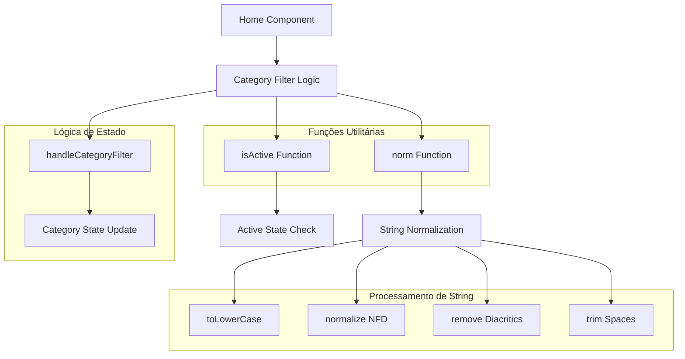
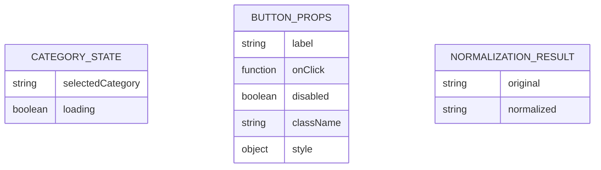

# Arquitetura Técnica – Correção Botão "Bolsas Térmicas"

## 1. Design da Arquitetura



## 2. Descrição da Tecnologia

* Frontend: React\@18 + TypeScript + Tailwind CSS

* Estado: React Hooks (useState)

* Normalização: JavaScript Intl.Normalize API

* Regex: Unicode Property Escapes para remoção de diacríticos

## 3. Definições de Rotas

Esta correção não envolve alterações de rotas, sendo implementada dentro do componente existente da página Home/Catálogo.

## 4. Definições de API

Não aplicável - esta correção é puramente frontend, não requerendo alterações de API.

## 5. Arquitetura do Componente



## 6. Modelo de Dados

### 6.1 Definição do Modelo de Dados



### 6.2 Linguagem de Definição de Dados

```typescript
// Tipos para o sistema de categorias
interface CategoryState {
  selectedCategory?: string;
  loading: boolean;
}

// Função de normalização
type NormalizationFunction = (input: string) => string;

// Função de verificação de estado ativo
type ActiveCheckFunction = (selected?: string, label?: string) => boolean;

// Handler de filtro de categoria
type CategoryFilterHandler = (label: string) => void;

// Implementação das funções utilitárias
const norm: NormalizationFunction = (s: string) => 
  s?.toLowerCase()
    .normalize('NFD')
    .replace(/\p{Diacritic}/gu, '')
    .replace(/\s+/g, ' ')
    .trim();

const isActive: ActiveCheckFunction = (selected?: string, label?: string) => 
  norm(selected || '') === norm(label || '');

// Estrutura do botão de categoria
interface CategoryButtonProps {
  label: string;
  onClick: () => void;
  disabled: boolean;
  isActive: boolean;
  className: string;
  style?: React.CSSProperties;
}

// Estado do componente
interface HomeComponentState {
  selectedCategory?: string;
  catalogState: {
    loading: boolean;
    products: Product[];
  };
}
```

## 7. Detalhes da Implementação

### 7.1 Função de Normalização

* **Propósito**: Padronizar strings para comparação consistente

* **Processo**: toLowerCase → normalize('NFD') → remove diacríticos → trim espaços

* **Performance**: O(n) onde n é o comprimento da string

* **Compatibilidade**: Suporte nativo em navegadores modernos

### 7.2 Verificação de Estado Ativo

* **Propósito**: Determinar se um botão deve aparecer como ativo

* **Lógica**: Comparação de strings normalizadas

* **Fallback**: Strings vazias tratadas como valores padrão

### 7.3 Handler de Filtro

* **Responsabilidade**: Atualizar estado da categoria selecionada

* **Normalização**: Aplica `norm()` antes de salvar no estado

* **Efeito**: Dispara re-renderização com novo estado

### 7.4 Renderização Condicional

* **Classes CSS**: Aplicadas condicionalmente baseadas em `isActive()`

* **Estilos inline**: backgroundColor dinâmico para botões ativos

* **Estados**: Suporte a loading e disabled

## 8. Considerações de Performance

* **Normalização**: Executada apenas quando necessário (onClick e render)

* **Memoização**: Potencial otimização futura com useMemo para strings normalizadas

* **Re-renders**: Minimizados através de comparação eficiente de estado

* **Regex Performance**: Unicode Property Escapes são otimizadas pelo engine JavaScript

## 9. Compatibilidade e Suporte

* **Navegadores**: Chrome 64+, Firefox 78+, Safari 11.1+, Edge 79+

* **TypeScript**: Versão 4.1+ para suporte completo a Unicode Property Escapes

* **React**: Compatível com versões 16.8+ (hooks)

* **Tailwind CSS**: Classes utilitárias mantêm compatibilidade existente

