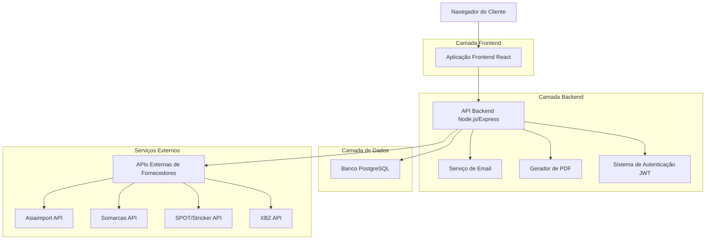
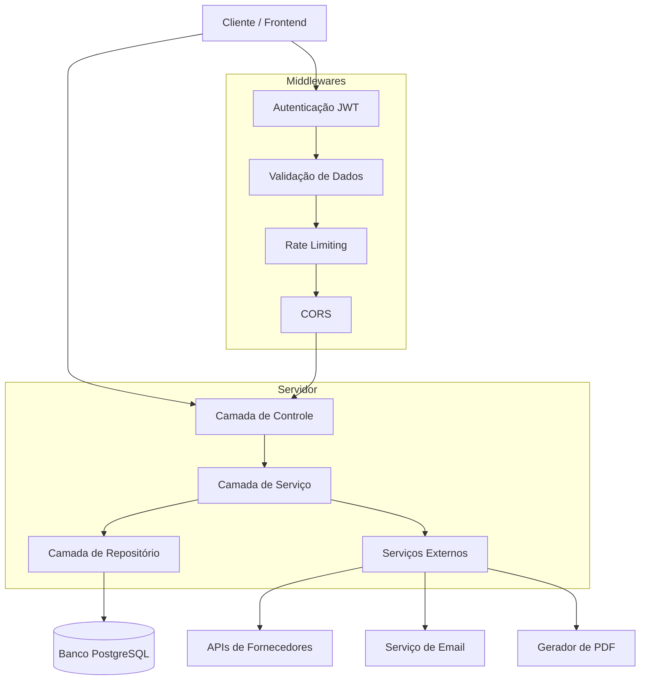
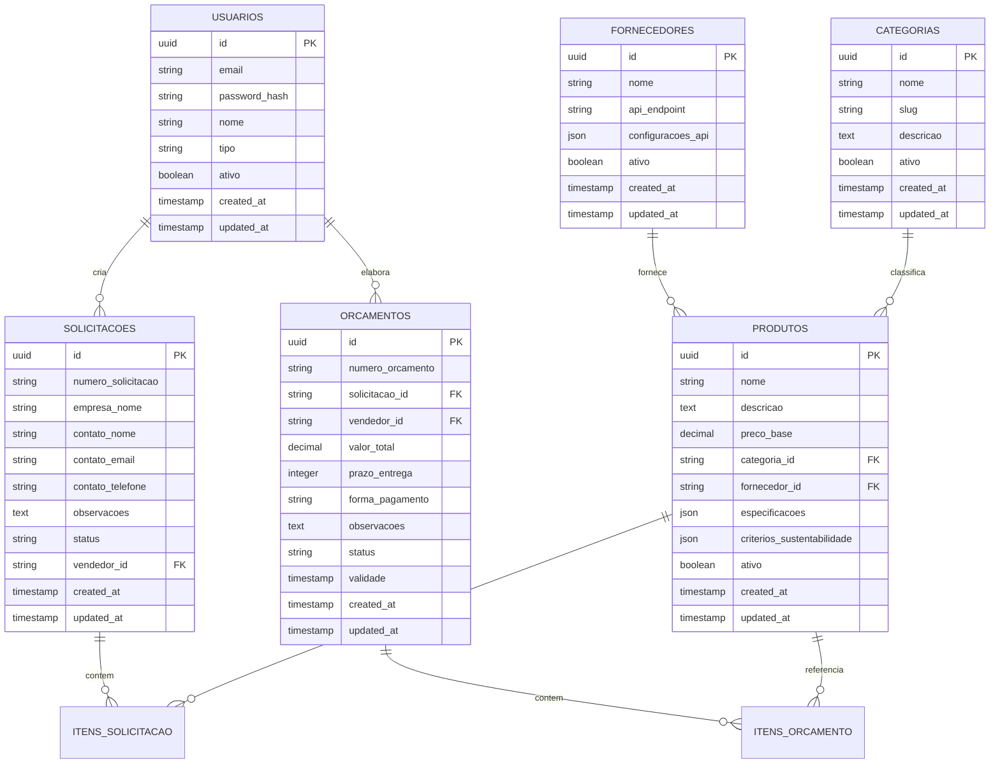

# Documento de Arquitetura Técnica - Natureza Brindes

## 1. Design da Arquitetura



## 2. Descrição das Tecnologias

* **Frontend**: React\@18 + TypeScript + Tailwind CSS + Vite + React Router + Axios

* **Backend**: Node.js\@18 + Express\@4 + TypeScript + JWT + Multer + Nodemailer

* **Banco de Dados**: PostgreSQL\@15 + Prisma ORM

* **Serviços**: PDFKit para geração de PDF, Nodemailer para emails, Cloudinary para imagens

## 3. Definições de Rotas

| Rota                   | Propósito                                                      |
| ---------------------- | -------------------------------------------------------------- |
| /                      | Página inicial com banner e vitrine de produtos sustentáveis   |
| /produtos              | Catálogo completo com filtros de sustentabilidade e pesquisa   |
| /produto/:id           | Detalhes do produto com galeria, especificações e configurador |
| /carrinho              | Carrinho de compras com itens selecionados e observações       |
| /orcamento             | Formulário de solicitação de orçamento com dados da empresa    |
| /orcamento/confirmacao | Página de confirmação após envio da solicitação                |
| /admin                 | Dashboard administrativo com métricas e solicitações           |
| /admin/solicitacoes    | Gestão detalhada de solicitações de orçamento                  |
| /admin/orcamentos      | Interface para criação e envio de orçamentos                   |
| /admin/produtos        | Gestão do catálogo de produtos sustentáveis                    |
| /admin/vendedores      | Controle de usuários vendedores e permissões                   |
| /admin/relatorios      | Relatórios de performance e métricas de conversão              |
| /login                 | Autenticação para acesso ao painel administrativo              |

## 4. Definições de API

### 4.1 APIs Principais

**Autenticação de usuários**

```
POST /api/auth/login
```

Request:

| Nome do Parâmetro | Tipo   | Obrigatório | Descrição                                  |
| ----------------- | ------ | ----------- | ------------------------------------------ |
| email             | string | true        | Email do usuário administrador ou vendedor |
| password          | string | true        | Senha do usuário                           |

Response:

| Nome do Parâmetro | Tipo    | Descrição                    |
| ----------------- | ------- | ---------------------------- |
| success           | boolean | Status da autenticação       |
| token             | string  | Token JWT para autenticação  |
| user              | object  | Dados do usuário autenticado |

Exemplo:

```json
{
  "email": "admin@naturezabrindes.com",
  "password": "senha123"
}
```

**Gestão de produtos**

```
GET /api/produtos
POST /api/produtos
PUT /api/produtos/:id
DELETE /api/produtos/:id
```

**Solicitações de orçamento**

```
POST /api/solicitacoes
GET /api/solicitacoes
PUT /api/solicitacoes/:id/status
```

**Geração de orçamentos**

```
POST /api/orcamentos
GET /api/orcamentos/:id/pdf
POST /api/orcamentos/:id/enviar
```

**Integrações com fornecedores**

```
GET /api/fornecedores/asiaimport/produtos
GET /api/fornecedores/somarcas/produtos
GET /api/fornecedores/spot/produtos
GET /api/fornecedores/xbz/produtos
POST /api/fornecedores/sincronizar
```

## 5. Diagrama da Arquitetura do Servidor



## 6. Modelo de Dados

### 6.1 Definição do Modelo de Dados



### 6.2 Linguagem de Definição de Dados

**Tabela de Usuários (usuarios)**

```sql
-- Criar tabela de usuários
CREATE TABLE usuarios (
    id UUID PRIMARY KEY DEFAULT gen_random_uuid(),
    email VARCHAR(255) UNIQUE NOT NULL,
    password_hash VARCHAR(255) NOT NULL,
    nome VARCHAR(100) NOT NULL,
    tipo VARCHAR(20) DEFAULT 'vendedor' CHECK (tipo IN ('admin', 'vendedor')),
    ativo BOOLEAN DEFAULT true,
    created_at TIMESTAMP WITH TIME ZONE DEFAULT NOW(),
    updated_at TIMESTAMP WITH TIME ZONE DEFAULT NOW()
);

-- Criar índices
CREATE INDEX idx_usuarios_email ON usuarios(email);
CREATE INDEX idx_usuarios_tipo ON usuarios(tipo);

-- Dados iniciais
INSERT INTO usuarios (email, password_hash, nome, tipo) VALUES
('admin@naturezabrindes.com', '$2b$10$hash_da_senha', 'Administrador', 'admin'),
('vendedor1@naturezabrindes.com', '$2b$10$hash_da_senha', 'Vendedor 1', 'vendedor');
```

**Tabela de Produtos (produtos)**

```sql
-- Criar tabela de produtos
CREATE TABLE produtos (
    id UUID PRIMARY KEY DEFAULT gen_random_uuid(),
    nome VARCHAR(255) NOT NULL,
    descricao TEXT,
    preco_base DECIMAL(10,2),
    categoria_id UUID REFERENCES categorias(id),
    fornecedor_id UUID REFERENCES fornecedores(id),
    especificacoes JSONB,
    criterios_sustentabilidade JSONB,
    imagens JSONB,
    ativo BOOLEAN DEFAULT true,
    created_at TIMESTAMP WITH TIME ZONE DEFAULT NOW(),
    updated_at TIMESTAMP WITH TIME ZONE DEFAULT NOW()
);

-- Criar índices
CREATE INDEX idx_produtos_categoria ON produtos(categoria_id);
CREATE INDEX idx_produtos_fornecedor ON produtos(fornecedor_id);
CREATE INDEX idx_produtos_ativo ON produtos(ativo);
CREATE INDEX idx_produtos_criterios_gin ON produtos USING GIN (criterios_sustentabilidade);
```

**Tabela de Solicitações (solicitacoes)**

```sql
-- Criar tabela de solicitações
CREATE TABLE solicitacoes (
    id UUID PRIMARY KEY DEFAULT gen_random_uuid(),
    numero_solicitacao VARCHAR(20) UNIQUE NOT NULL,
    empresa_nome VARCHAR(255) NOT NULL,
    empresa_cnpj VARCHAR(18),
    contato_nome VARCHAR(100) NOT NULL,
    contato_email VARCHAR(255) NOT NULL,
    contato_telefone VARCHAR(20),
    endereco_entrega TEXT,
    observacoes TEXT,
    status VARCHAR(20) DEFAULT 'pendente' CHECK (status IN ('pendente', 'em_analise', 'orcado', 'aprovado', 'rejeitado')),
    vendedor_id UUID REFERENCES usuarios(id),
    created_at TIMESTAMP WITH TIME ZONE DEFAULT NOW(),
    updated_at TIMESTAMP WITH TIME ZONE DEFAULT NOW()
);

-- Criar índices
CREATE INDEX idx_solicitacoes_status ON solicitacoes(status);
CREATE INDEX idx_solicitacoes_vendedor ON solicitacoes(vendedor_id);
CREATE INDEX idx_solicitacoes_created_at ON solicitacoes(created_at DESC);
```

**Tabela de Itens de Solicitação (itens\_solicitacao)**

```sql
-- Criar tabela de itens de solicitação
CREATE TABLE itens_solicitacao (
    id UUID PRIMARY KEY DEFAULT gen_random_uuid(),
    solicitacao_id UUID REFERENCES solicitacoes(id) ON DELETE CASCADE,
    produto_id UUID REFERENCES produtos(id),
    quantidade INTEGER NOT NULL,
    cores_impressao INTEGER DEFAULT 1 CHECK (cores_impressao BETWEEN 1 AND 4),
    personalizacao TEXT,
    observacoes TEXT,
    created_at TIMESTAMP WITH TIME ZONE DEFAULT NOW()
);

-- Criar índices
CREATE INDEX idx_itens_solicitacao_solicitacao ON itens_solicitacao(solicitacao_id);
CREATE INDEX idx_itens_solicitacao_produto ON itens_solicitacao(produto_id);
```

**Tabela de Orçamentos (orcamentos)**

```sql
-- Criar tabela de orçamentos
CREATE TABLE orcamentos (
    id UUID PRIMARY KEY DEFAULT gen_random_uuid(),
    numero_orcamento VARCHAR(20) UNIQUE NOT NULL,
    solicitacao_id UUID REFERENCES solicitacoes(id),
    vendedor_id UUID REFERENCES usuarios(id),
    valor_total DECIMAL(12,2) NOT NULL,
    prazo_entrega INTEGER NOT NULL,
    forma_pagamento TEXT,
    observacoes TEXT,
    status VARCHAR(20) DEFAULT 'rascunho' CHECK (status IN ('rascunho', 'enviado', 'aprovado', 'rejeitado', 'expirado')),
    validade TIMESTAMP WITH TIME ZONE NOT NULL,
    pdf_path VARCHAR(500),
    created_at TIMESTAMP WITH TIME ZONE DEFAULT NOW(),
    updated_at TIMESTAMP WITH TIME ZONE DEFAULT NOW()
);

-- Criar índices
CREATE INDEX idx_orcamentos_solicitacao ON orcamentos(solicitacao_id);
CREATE INDEX idx_orcamentos_vendedor ON orcamentos(vendedor_id);
CREATE INDEX idx_orcamentos_status ON orcamentos(status);
CREATE INDEX idx_orcamentos_validade ON orcamentos(validade);
```

**Tabela de Fornecedores (fornecedores)**

```sql
-- Criar tabela de fornecedores
CREATE TABLE fornecedores (
    id UUID PRIMARY KEY DEFAULT gen_random_uuid(),
    nome VARCHAR(100) NOT NULL,
    slug VARCHAR(50) UNIQUE NOT NULL,
    api_endpoint VARCHAR(500),
    configuracoes_api JSONB,
    ativo BOOLEAN DEFAULT true,
    created_at TIMESTAMP WITH TIME ZONE DEFAULT NOW(),
    updated_at TIMESTAMP WITH TIME ZONE DEFAULT NOW()
);

-- Dados iniciais de fornecedores
INSERT INTO fornecedores (nome, slug, api_endpoint, ativo) VALUES
('Asiaimport', 'asiaimport', 'https://api.asiaimport.com', true),
('Somarcas', 'somarcas', 'https://api.somarcas.com', true),
('SPOT/Stricker', 'spot-stricker', 'https://api.spot-stricker.com', true),
('XBZ', 'xbz', 'https://api.xbz.com', true);
```

**Tabela de Categorias (categorias)**

```sql
-- Criar tabela de categorias
CREATE TABLE categorias (
    id UUID PRIMARY KEY DEFAULT gen_random_uuid(),
    nome VARCHAR(100) NOT NULL,
    slug VARCHAR(50) UNIQUE NOT NULL,
    descricao TEXT,
    icone VARCHAR(50),
    ativo BOOLEAN DEFAULT true,
    created_at TIMESTAMP WITH TIME ZONE DEFAULT NOW(),
    updated_at TIMESTAMP WITH TIME ZONE DEFAULT NOW()
);

-- Dados iniciais de categorias sustentáveis
INSERT INTO categorias (nome, slug, descricao, icone) VALUES
('Produtos Reciclados', 'produtos-reciclados', 'Brindes feitos com materiais reciclados', 'recycle'),
('Materiais Naturais', 'materiais-naturais', 'Produtos de bambu, cortiça e outros materiais naturais', 'leaf'),
('Energia Solar', 'energia-solar', 'Produtos com carregamento solar', 'sun'),
('Biodegradáveis', 'biodegradaveis', 'Produtos que se decompõem naturalmente', 'compost'),
('Reutilizáveis', 'reutilizaveis', 'Produtos para uso múltiplo e duradouro', 'refresh');
```

