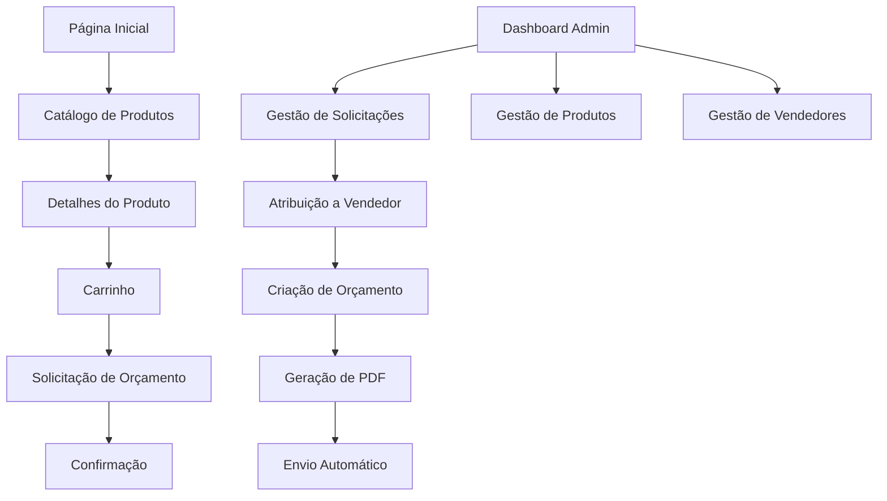

# Documento de Requisitos do Produto - Natureza Brindes

## 1. Visão Geral do Produto
Plataforma e-commerce especializada em brindes ecológicos e sustentáveis com sistema completo de solicitação de orçamentos e painel administrativo.
- Soluciona a necessidade de empresas encontrarem brindes corporativos sustentáveis de forma eficiente e personalizada.
- Público-alvo: Empresas de todos os portes que buscam brindes corporativos com foco em sustentabilidade.
- Objetivo: Conectar empresas a fornecedores de produtos ecológicos através de uma plataforma digital integrada.

## 2. Funcionalidades Principais

### 2.1 Papéis de Usuário
| Papel | Método de Registro | Permissões Principais |
|-------|-------------------|----------------------|
| Cliente | Email e dados da empresa | Navegar catálogo, solicitar orçamentos, acompanhar propostas |
| Vendedor | Convite do administrador | Gerenciar solicitações atribuídas, criar orçamentos, comunicar com clientes |
| Administrador | Acesso direto do sistema | Gestão completa de produtos, vendedores, relatórios e configurações |

### 2.2 Módulos de Funcionalidade
Nossa plataforma de brindes ecológicos consiste nas seguintes páginas principais:
1. **Página Inicial**: banner principal com destaques, vitrine de produtos ecológicos, barra de pesquisa integrada.
2. **Catálogo de Produtos**: listagem com filtros de sustentabilidade, ordenação por relevância/preço, paginação.
3. **Detalhes do Produto**: galeria de imagens, especificações técnicas, seletor de quantidade e cores de impressão.
4. **Carrinho de Compras**: lista de produtos selecionados, edição de quantidades, campo de observações.
5. **Solicitação de Orçamento**: formulário de dados da empresa, comentários específicos, confirmação de envio.
6. **Dashboard Administrativo**: métricas gerais, gestão de solicitações, controle de vendedores e produtos.
7. **Gestão de Orçamentos**: criação de propostas, geração de PDF, envio automático por email.

### 2.3 Detalhes das Páginas
| Nome da Página | Nome do Módulo | Descrição da Funcionalidade |
|----------------|----------------|-----------------------------|
| Página Inicial | Banner Principal | Exibir destaques rotativos de produtos sustentáveis com call-to-action |
| Página Inicial | Vitrine de Produtos | Mostrar grid responsivo dos principais brindes ecológicos com filtros rápidos |
| Página Inicial | Barra de Pesquisa | Busca inteligente com sugestões automáticas e filtros de sustentabilidade |
| Catálogo | Sistema de Filtros | Filtrar por categoria, material sustentável, preço, certificações ambientais |
| Catálogo | Ordenação | Organizar resultados por relevância, preço, popularidade, novidades |
| Detalhes do Produto | Galeria de Imagens | Visualizar múltiplas fotos com zoom, vídeos demonstrativos |
| Detalhes do Produto | Configurador | Selecionar quantidade, cores de impressão (1-4 cores), personalização |
| Detalhes do Produto | Ações do Produto | Adicionar ao carrinho, falar com consultor, compartilhar produto |
| Carrinho | Gestão de Itens | Editar quantidades, remover produtos, calcular totais estimados |
| Carrinho | Observações | Campo para comentários específicos sobre personalização e entrega |
| Solicitação de Orçamento | Formulário de Dados | Capturar informações da empresa, contato responsável, dados de entrega |
| Solicitação de Orçamento | Confirmação | Validar dados, gerar número de solicitação, enviar confirmação por email |
| Dashboard Admin | Métricas | Exibir KPIs de conversão, solicitações pendentes, vendas por período |
| Dashboard Admin | Lista de Solicitações | Visualizar, filtrar e atribuir solicitações por status e vendedor |
| Gestão de Orçamentos | Editor de Proposta | Criar orçamento detalhado com preços, prazos, condições comerciais |
| Gestão de Orçamentos | Geração de PDF | Produzir documento profissional com identidade visual da empresa |
| Gestão de Produtos | Cadastro | Adicionar produtos com especificações, imagens, critérios de sustentabilidade |
| Gestão de Vendedores | Controle de Usuários | Cadastrar vendedores, definir permissões, acompanhar performance |

## 3. Processo Principal

**Fluxo do Cliente:**
O cliente acessa a plataforma, navega pelo catálogo de produtos sustentáveis utilizando filtros específicos, seleciona produtos de interesse configurando quantidades e personalizações, adiciona itens ao carrinho com observações detalhadas, preenche formulário de solicitação de orçamento com dados da empresa e recebe confirmação automática por email.

**Fluxo do Administrador:**
O administrador monitora solicitações no dashboard, atribui leads para vendedores específicos, acompanha o processo de criação de orçamentos, aprova propostas antes do envio, gera relatórios de performance e gerencia o catálogo de produtos sustentáveis.

**Fluxo do Vendedor:**
O vendedor recebe notificação de solicitação atribuída, analisa detalhes do cliente e produtos solicitados, elabora orçamento personalizado com preços e prazos, gera PDF profissional da proposta e envia automaticamente para o cliente via sistema.

## 4. Design da Interface do Usuário

### 4.1 Estilo de Design
- **Cores Primárias**: Verde sustentável (#2CB20B) como cor principal, branco (#FFFFFF) como cor secundária
- **Estilo de Botões**: Botões arredondados com cantos suaves, efeito hover sutil, gradientes verdes
- **Tipografia**: Fonte moderna sans-serif (Inter ou Roboto), tamanhos 14px-18px para texto, 24px-32px para títulos
- **Layout**: Design baseado em cards, navegação superior fixa, sidebar administrativa, grid responsivo
- **Ícones e Emojis**: Ícones de folhas, reciclagem, natureza; emojis relacionados à sustentabilidade (🌱, ♻️, 🌍)

### 4.2 Visão Geral do Design das Páginas
| Nome da Página | Nome do Módulo | Elementos da UI |
|----------------|----------------|----------------|
| Página Inicial | Banner Principal | Carousel full-width com imagens de alta qualidade, overlay verde translúcido, botões CTA em branco |
| Página Inicial | Vitrine de Produtos | Grid 4 colunas desktop/2 mobile, cards com sombra sutil, badges de sustentabilidade verdes |
| Catálogo | Filtros Laterais | Sidebar esquerda com acordeões, checkboxes personalizados, slider de preço verde |
| Detalhes do Produto | Galeria | Layout 60/40 imagem/informações, thumbnails inferiores, zoom modal |
| Carrinho | Lista de Produtos | Tabela responsiva, botões de quantidade circulares, totais destacados em verde |
| Dashboard Admin | Métricas | Cards com ícones, gráficos em tons de verde, tabelas com zebra striping |
| Gestão de Orçamentos | Editor | Formulário em duas colunas, preview em tempo real, botões de ação destacados |

### 4.3 Responsividade
A plataforma segue abordagem mobile-first com breakpoints em 768px e 1024px. Otimizada para interação touch com botões de tamanho adequado (44px mínimo), gestos de swipe no carousel e navegação por tabs em dispositivos móveis. Layout adaptativo que prioriza conteúdo essencial em telas menores.